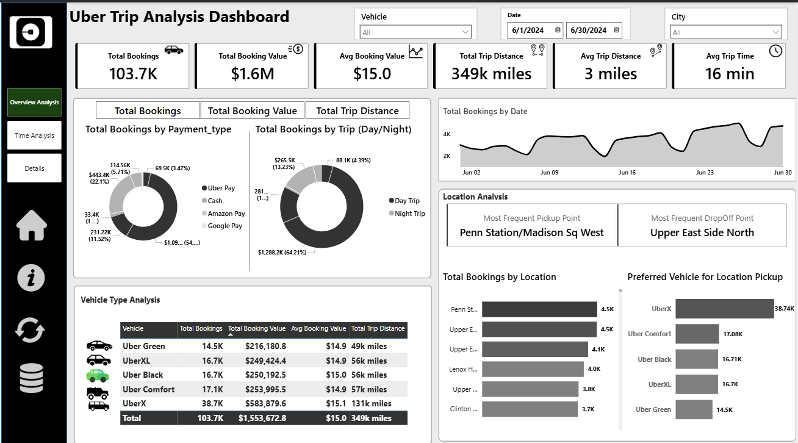
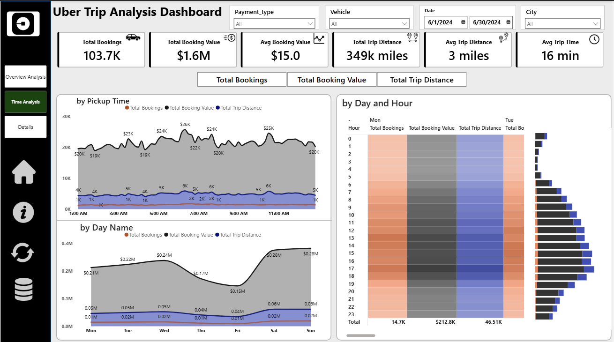
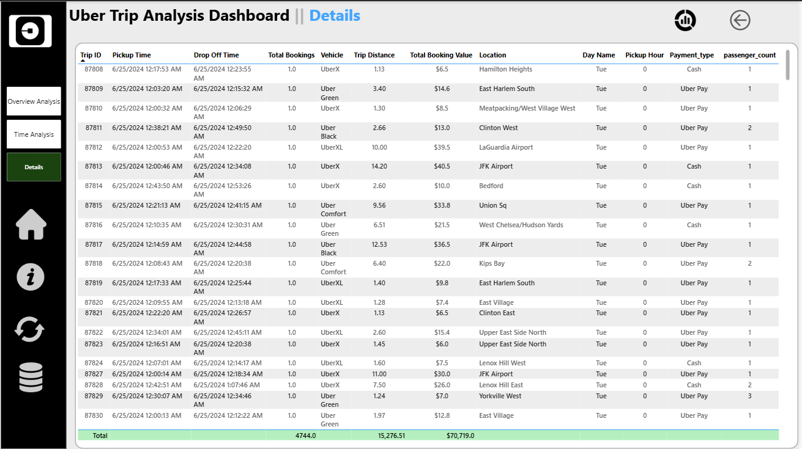

#  Uber Trip Analysis Dashboard – Power BI Project

##  Project Overview

This project analyzes **103,700+ Uber trip records** using Microsoft Power BI to generate operational and business insights. The dashboard enables users to monitor booking trends, revenue, trip distance, vehicle performance, customer payment behavior, and location-based analytics through interactive visualizations.

The solution demonstrates data modeling, DAX calculations, drill-through functionality, and interactive reporting to support data-driven decision-making.

---

##  Business Problem

Ride-hailing companies generate large volumes of trip data every day. Without proper analysis, it becomes difficult to:

- Monitor booking trends and revenue
- Identify peak demand periods
- Compare vehicle performance
- Analyze customer payment preferences
- Identify high-demand pickup and drop-off locations
- Track operational KPIs efficiently

This project transforms raw trip data into an interactive Power BI dashboard that provides meaningful business insights.

---

##  Tools & Technologies Used

- Microsoft Power BI
- Power Query
- DAX (Data Analysis Expressions)
- Data Modeling
- Drill-through
- Interactive Slicers
- KPI Cards
- Microsoft Excel

---

##  Dataset

This project analyzes **103,700+ Uber trip records** along with a supporting Location table.

### Fact Table
- Uber Trip Details

### Dimension Tables
- Calendar
- Location Table

### Dataset Includes

- Trip ID
- Pickup Time
- Drop Off Time
- Passenger Count
- Trip Distance
- Pickup Location
- Drop-off Location
- Fare Amount
- Vehicle Type
- Payment Type

---

##  Dashboard Pages

###  1. Overview Analysis

Provides a high-level business summary through KPI cards and interactive visuals.

**KPIs**
- Total Bookings
- Total Booking Value
- Average Booking Value
- Total Trip Distance
- Average Trip Distance
- Average Trip Time

**Visualizations**
- Payment Type Analysis
- Day vs Night Trip Analysis
- Booking Trend by Date
- Vehicle Performance Analysis
- Pickup & Drop-off Location Analysis
- Vehicle-wise Booking Summary

---

###  2. Time Analysis

Analyzes booking behavior across different time dimensions.

**Includes**

- Pickup Time Analysis
- Day-wise Booking Trend
- Day & Hour Heatmap
- Dynamic KPI Selection
- Time-based Interactive Filtering

This page helps identify peak booking periods and customer travel patterns.

---

###  3. Trip Details

Provides transaction-level information including:

- Trip ID
- Pickup & Drop-off Time
- Vehicle Type
- Trip Distance
- Booking Value
- Payment Type
- Passenger Count
- Pickup Location

Supports detailed analysis using drill-through functionality.

---

##  Data Modeling

A star-schema data model was implemented by connecting the Uber Trip Details fact table with Calendar and Location dimension tables, enabling efficient filtering and accurate business reporting.

---

##  Key Insights

- UberX recorded the highest number of bookings.
- Booking activity increased toward the end of the month.
- Day trips accounted for the majority of bookings.
- Uber Pay was the most frequently used payment method.
- Penn Station / Madison Sq West was the most frequent pickup location.
- Upper East Side North was the most frequent drop-off location.

---

##  Business Impact

This dashboard enables business teams to:

- Monitor booking performance in real time
- Track revenue and trip trends
- Analyze customer payment behavior
- Optimize vehicle allocation
- Identify high-demand locations
- Support operational and strategic decision-making using data

---

##  Dashboard Preview

### 1️ Overview Dashboard

---

### 2️ Time Analysis Dashboard

---

### 3️ Trip Details Dashboard

---

##  Project Highlights

-  Analyzed **103,700+ Uber trip records**
-  Built a star-schema data model
-  Created DAX measures and KPIs
-  Developed 3 interactive report pages
-  Implemented drill-through functionality
-  Designed interactive dashboards with slicers and cross-filtering

---

##  Author

**Mohan Thurpati**

Aspiring Data Analyst

- **LinkedIn:** *( www.linkedin.com/in/mohanthurpati )*
- **GitHub:** *( https://github.com/MohanThurpati )*
